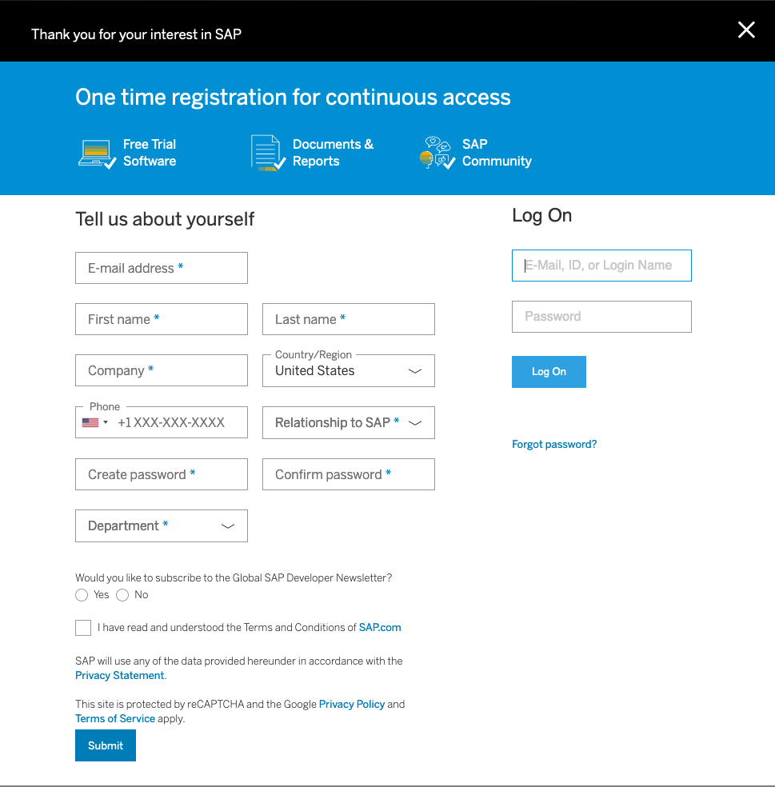
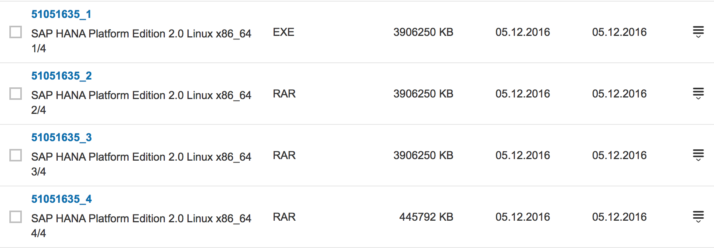

# SAP HANA on RHEL 8.x
> Deploying SAP HANA on Red Hat Enterprise Linux 8.x

## Environment Setup Lab

This lab has two parts. In the first part, you set up the lab environment. In the second part, which is optional, you download the installation media for SAP HANA<sup>(R)</sup>, platform edition or SAP HANA, express edition, and then upload it to the lab environment.

If you plan to install SAP HANA, Red Hat<sup>(R)</sup> recommends that you begin the process now so that you can continue with the course while the download proceeds in the background. See the <<download>> section for the steps you need to get started.

### Goals

- Review lab prerequisites
- Set up and access the lab environment
- Download the SAP HANA software

### Prerequisites

You need the following accounts to access important information and necessary software:

- **SAP S user account:** This account allows you to download software and generate license keys from [SAP Service Marketplace](http://service.sap.com). You need this account to download SAP HANA, platform edition.

- **Red Hat Customer Portal account:** The Red Hat Customer Portal account is also known as a Red Hat Network Classic or RHN account. This account allows you to download Red Hat software and access support articles from [Red Hat Customer Portal](http://access.redhat.com).

### IMPORTANT NOTES

- **If you do not have an SAP S user account, contact your company's SAP administrator and request an account with `software download` authorization. It may take up to two days to process your account request. You can also register and download the SAP HANA, express edition for this lab if you do not obtain an SAP S user account in time.**

- **You can create a Red Hat Customer Portal account at [redhat.com](http://www.redhat.com).**

### Lab Environment

In this course, you do most of the hands-on practice exercises and lab work with a single dedicated computer system. This system is preinstalled with a Red Hat Enterprise Linux<sup>(R)</sup> (RHEL) base server. A Red Hat Enterprise Linux for SAP Solutions subscription is provided on the system, as well as disk partitions with enough space to install SAP HANA. The entire environment is hosted in the cloud, but the system configuration resembles a bare-metal environment.

### Provision Lab Environment

**This section is extremely important. Please read and understand it before continuing with the course.**

- Log in to the [OPENTLC lab portal](http://labs.opentlc.com).
- Go to **Services -> Catalogs -> All Services -> OPENTLC Datacenter Infrastructure Labs**.
- On the left side of the screen, click **THIS CI DOES NOT EXIST YET**.
- On the right, click **Order**.
- At the bottom right, click **Submit**.

You will receive an email with information about how to access your lab environment. It takes about 30 minutes for your lab to completely load and be accessible.

### Access System via SSH

Your lab environment consists of a bastion host and a Red Hat Enterprise Linux server. You must log in to `bastion host` first and then log in to the RHEL server.

You access your bastion using an SSH client pointed to the host name that you received in your provisioning email. You must log in using the provided credentials and keys in the email instructions.


- Log in to `workstation` using SSH
```bash
$ ssh -i /path-to-your-ssh-key cloud-user@bastion-<GUID>.<DOMAIN>
```

- Log in to the RHEL server using SSH:
```bash
[cloud-user@bastion-<GUID> ~]# ssh hana-<GUID>
```

- Become root in the RHEL server:
```bash
[cloud-user@hana-<GUID> ~]# sudo -i
[root@hana-<GUID> ~]#
```

**Unless noted otherwise, you execute all of the command line instructions in the lab as the `root` user.**

### Download SAP HANA Installation Media (**Optional**)

Due to End User License Agreement (EULA) restrictions, Red Hat OPEN cannot provide the installation media for SAP HANA in this training course. You must download the media yourself. You have two options to get the installation media in the environment:

- **Option 1**: Register for SAP HANA, express edition, download the installer, and start the download in the environment. Download time is about 5 minutes and you do not need an SAP S user account for it.

- **Option 2**: Download the SAP HANA, platform edition software from the SAP Service Marketplace. You need an SAP S user account and a couple of hours to upload the installation media.

### Option 1: Download SAP HANA Express Edition

The fastest and easiest way to access SAP HANA is to download SAP HANA, express edition.

SAP HANA, express edition is a streamlined version of SAP HANA, platform edition and requires fewer resources. It lacks the following features (among others):

- Smart data integration (SDI)
- Smart data streaming
- System replication (HSR)
- Dynamic tiering

For a comprehensive list, see the [SAP HANA express edition FAQ page](http://news.sap.com/germany/files/2017/01/SAP-HANA-Express-Edition-FAQ-extern.pdf.

For this lab, you need to download the binary installer as described in detail on the [express edition installation page](https://www.sap.com/developer/tutorials/hxe-ua-installing-binary.html).

As the SAP tutorial only describes the graphical interface, which is not feasible for the training server in the cloud, you need to do the following:

- Register for the express edition at ["https://www.sap.com/sap-hana-express](https://www.sap.com/sap-hana-express)

    

- Download the platform-independent installer, `HXEDownloadManager.jar`:

    

- Copy the installer to `bastion`:

    ```bash
    $ scp HXEDownloadManager.jar cloud-user@bastion-<GUID>.<DOMAIN>:/nfs/
    HXEDownloadManager.jar                             100%  561KB 971.1KB/s   00:00
    ```

- If you use MobaXterm on Windows, log in to `bastion` and drag the JAR file to the dialog box on the left, or use `winscp` to upload the files.

- Log in to `bastion`, change to the `/nfs` directory, and confirm that the file is there:

    ```bash
    $ ssh cloud-user@bastion-<GUID>.<DOMAIN>
    [cloud-user@bastion-<GUID> ~]$ ls /nfs
    HXEDownloadManager.jar
    ```

- Download the express edition:
```bash
[cloud-user@bastion-<GUID> ~]$ cd /nfs
[cloud-user@bastion-<GUID> nfs]$ java -jar HXEDownloadManager.jar -d . linuxx86_64 installer hxe.tgz
Connecting to download server...

SAP HANA, express edition version: 2.00.040.00.20190729.1

WARNING: The package(s) you chose to download require a minimum of 8 GB of memory to install.  You only have 1 GB on this system.
Downloading "Server only installer"...
hxe.tgz : 100%
Concatenate download files to ./hxe.tgz...
./hxe.tgz created.
Verify ./hxe.tgz file checksum...
./hxe.tgz file checksum is OK.
```

### Option 2: Download SAP HANA Platform Edition

You must download the installation media from the SAP Service Marketplace using your SAP S user account. If you do not have an SAP S user account, contact your company's SAP administrator and request an account with _software download_ authorization. It may take up to two days to process your account request.

IMPORTANT: Start the download as soon as possible. It may take a while to complete.

You can either download the full installation media or, to save time, download the much smaller service pack.

#### Download the full installation media from the SAP Service Marketplace:

- Point your browser to [https://launchpad.support.sap.com/#/softwarecenter](https://launchpad.support.sap.com/#/softwarecenter).
- Select **Installations and Upgrades**.
- Select **A-Z Index -> H**.
- Select **SAP In-Memory (SAP HANA) -> HANA Platform Edition -> SAP HANA PLATFORM EDITION -> SAP HANA PLATFORM EDITION 2.0**.
- Select **Installation**.

Here is an example of the download media. The media's object number may change when SAP releases updates, so use the description to confirm the version instead of the object number:



#### Alternatively, download the SAP HANA 2.0 service pack from the SAP Service Marketplace:

- Point your browser to [https://launchpad.support.sap.com/#/softwarecenter](https://launchpad.support.sap.com/#/softwarecenter).
- Select **SUPPORT PACKAGES AND PATCHES**.
- Select **A-Z Index -> H**.
- Select **SAP HANA PLATFORM EDITION -> SAP HANA PLATFORM EDITION 2.0**.
- Select **SAP HANA DATABASE 2.0 -> LINUX ON X86_64 64BIT**.
- Navigate to **SUPPORT PACKAGES AND PATCHES -> A-Z -> S -> SAPCAR -> SAPCAR 7.21 -> Linux on x86_64 64bit -> SAPCAR_712-80000935.EXE** to download `SAPCAR`

Here is an example of the download media. The media's object number may change when SAP releases updates, so use the description to confirm the version instead of the object number:


Upload the SAP HANA software from your client to the `/nfs` directory on `bastion`:
```bash
$ scp IMDB_SERVER20_00_0-80002031.SAR cloud-user@bastion-<GUID>.<DOMAIN>:/nfs/
$ scp SAPCAR_712-80000935.EXE cloud-user@bastion-<GUID>.<DOMAIN>:/nfs/
```

**IMPORTANT**

- Make sure you upload the SAP HANA software to the `/nfs` directory on `bastion`, which is mounted to the RHEL server, so you do not have to transfer the file to the RHEL server.

- Start the upload as soon as you have access to the system. The upload may take several hours depending on the speed of your network connection.

- While the software upload is in progress, open another terminal, log in to the server, and prepare the system in parallel.