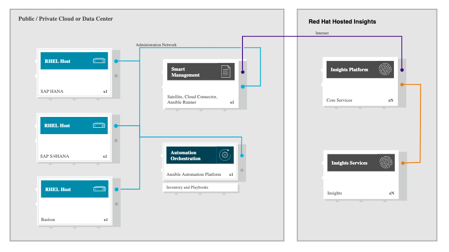
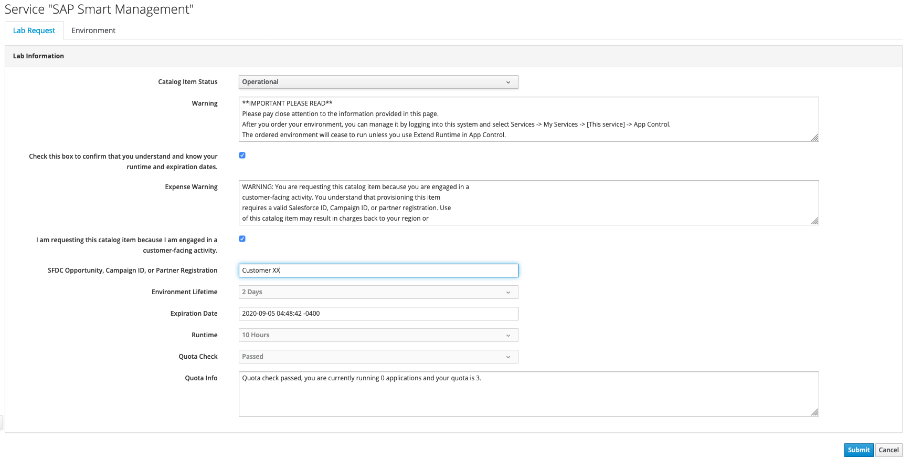

# SAP Smart Management (**WORK IN PROGRESS**)
> Using Red Hat Satellite and Red Hat Insights for SAP landscapes proactive monitoring, remediation and lifecycle management

## Intro

This workshop can be used to demonstrate the Smart Management capabilities for SAP Lansdcapes included as part of the `RHEL for SAP Solutions` subscription. 

## High-level architecture and components

The high-level architecture consists of 4 different RHEL 8.x servers with the following purposes:

- bastion: this is meant to be used as the jump host for SSH access to the environment
- tower: this is meant to be used as the Ansible and Ansible Tower host where to run the automation from
- hana: this is meant to be used as the RHEL server where to deploy SAP HANA
- s4hana: this is meant to be used as the RHEL server where to deploy SAP S/4HANA
- sat: this is meant to be used as the Red Hat Satellite host where to manage the SAP landscape

{:target="_blank"}

## Environment request

This environment is provisioned using the Red Hat internal demo system. We at Red Hat embrace the use of [IaC](https://openpracticelibrary.com/practice/everything-as-code/) (Infrastructure as Code) for any lab/demo set up, that's why we have open-sourced the Framework (based in Ansible) we use for this. If you want to get more information on this topic, check the [AgnosticD](https://github.com/redhat-cop/agnosticd) repository we use to deploy these labs and demos.

### Order catalog item

Login into [Red Hat Product Demo System](https://rhpds.redhat.com) and navigate to `Services --> Catalogs --> All Services --> Workshops`. An item called `SAP Smart Management` will be available.

Click on the **order** button, check the confirmation box and click on **Submit**.

### Environment info and credentials

Once the environment has been provisioned, you will receive an email with some key information:

- SSH information to access the bastion host including:
  - SSH user information
  - Bastion public hostbane information
  - SSH private key to be used
- Ansible Tower information including:
  - Ansible Tower public URL
  - Ansible Tower user
  - Ansible Tower Password
- Satellite host information including:
  - Red Hat Satellite public URL
  - Red Hat Satellite user
  - Red Hat Satellite Password

## How to run the demo/workshop

The goal for this demo is to showcase the management capabilities RHEL for SAP Solutions subscription can offer to SAP customers, helping them to manage SAP landscapes using Red Hat Satellite and Red Hat Insights. Red Hat Satellite can manage the whole lifecycle for you RHEL landscape, but the focus for this demo/workshop will be on the remediation and risk management capabilities from Inisights as well as bug fix and enhancement updates management from Satellite. With this in mind, these are the main points we are going to cover during this demo/workshop:

1. Explore Red Hat Satellite Monitor Dashboard and customize it to show specific widgets
2. Connect to the RHEL hosts for the given landscape and check what applications are running on those
3. Explore these RHEL hosts from the Satellite interface
4. Check existing erratas that applies to existing Hosts
5. Select and install applicable errata for existing Hosts
6. 
7. 
8. 